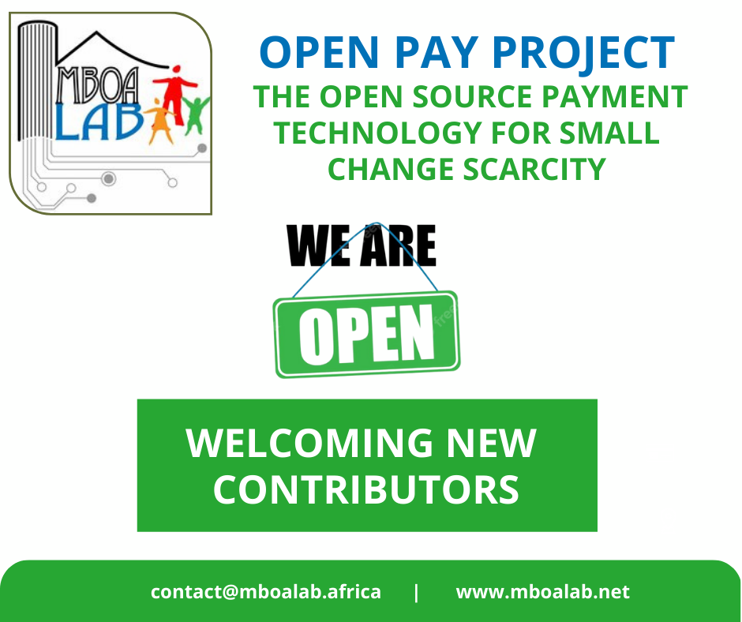

# Payment Solutions
  Payment Solutions encompass a range of services and technologies that enable people to securely and conveniently make payments. They include mobile payments, online transactions, contactless payments, and more. Payment Solutions provide an efficient way for customers to settle their bills without going through the hassle of cash transactions. Moreover, they are also used for international transactions, which further increases their convenience.Payment solutions are here to stay and businesses need to keep up with the latest updates in order to avoid any potential frauds or scams.Payment solutions are becoming increasingly important to the modern economy. With the proliferation of digital payments and financial technology (fintech) companies, businesses are able to make transactions faster and more securely than ever before. This has had a major impact on both consumers and businesses, allowing them to save time, reduce risk, and increase efficiency when making payments. As payment solutions continue to evolve, it is important for both businesses and consumers alike to understand how these new technologies can impact their day-to-day operations. In this article, we'll explore the different payment solutions available today and discuss their potential impacts on the modern economy.
  
  There are numerous payment solutions available today, each with their own unique features, benefits, and potential impacts on the modern economy. Here are some of the most popular payment solutions available today:

- Cash:
     Cash is the most traditional payment method and remains widely used in many parts of the world. It has the advantage of being widely accepted and easily accessible, but it can also be cumbersome to carry around and can be lost or stolen.

- Credit Cards:
     Credit cards are a popular payment solution that offer convenience and flexibility. They allow users to make purchases without having to carry cash and offer rewards and other perks. However, they also come with fees and interest rates that can add up quickly.

 - Debit Cards: Debit cards are similar to credit cards, but the funds are deducted directly from the user's bank account. They offer many of the same benefits as credit cards, but without the risk of accumulating debt.

  - Mobile Payments: Mobile payment solutions, such as Apple Pay and Google Pay, allow users to make purchases using their mobile devices. These payment solutions are convenient and easy to use, but they also require a smartphone and may be less widely accepted than other payment methods.

   - Cryptocurrency: Cryptocurrency, such as Bitcoin and Ethereum, is a digital payment solution that allows for secure and anonymous transactions. Cryptocurrency is still a relatively new payment solution and is not widely accepted by merchants, but it has the potential to revolutionize the way we make payments and conduct business.

Each payment solution has its own potential impacts on the modern economy. For example, cash remains a popular payment method, particularly in developing countries, but it can also be a target for theft and fraud. Credit and debit cards offer convenience and flexibility, but can also contribute to debt and financial instability. Mobile payments offer convenience and security, but may not be accessible to everyone. Cryptocurrency has the potential to provide a secure and decentralized payment solution, but its adoption is still in its early stages and there are concerns about its stability.

If you're interested in contributing to this project, we would love to hear from you! We're looking for individuals who are passionate about payment solutions and would like to share their expertise with others. You can contribute by writing blog posts, creating videos, or sharing your personal experience with different payment solutions. Please reach out to us if you're interested in getting involved!

 

[Open Pay Technical  Documentation In progress](https://docs.google.com/document/d/173qUWFruyyT6a9UbDYJaHxjMIkbV-DzSCZg2l1mAV5k/edit?usp=sharing)

  Stay Connected with Mboalab

   &nbsp;   &nbsp;   &nbsp;   &nbsp;   &nbsp;  